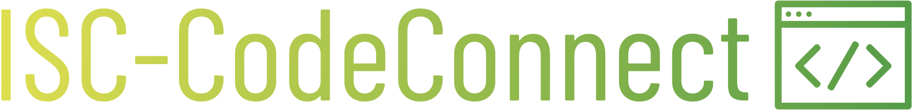
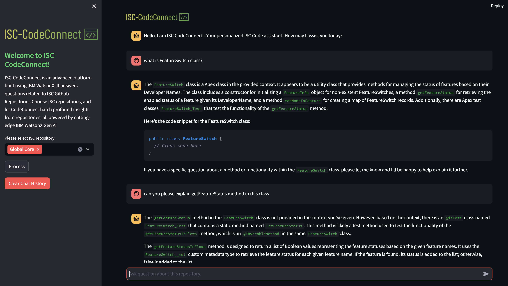

<div align="left">
  
</div>

## ISC-CodeConnect: Chat with IBM Sales Cloud (ISC) Github Repositories using IBM WatsonX, Langchain, ChromaDB and Streamlit (RAG)

Elevate your interaction with IBM Sales Cloud (ISC) GitHub repositories through an innovative chat interface powered by IBM WatsonX, Langchain, ChromaDB vector database, and Streamlit. This RAG (Retrieval Augmented Generation) application offers a seamless experience for exploring and understanding codebases.

## Features

- **IBM WatsonX Integration:** Input your IBM WatsonX API Key and GitHub Access Token for seamless access.
- **Repository Selection:** Choose one or multiple ISC GitHub repositories from the dropdown menu and initiate processing.
- **Repository Cloning and Chunking:** Repositories are cloned locally and segmented for efficient processing.
- **Embedding Conversion:** Utilizing Langchain, code segments are transformed into embeddings for enhanced analysis.
- **ChromaDB Vector Database:** Embeddings are stored in a ChromaDB vector database for rapid retrieval and querying.
- **QA Retriever:** Langchain constructs a QA retriever, enabling intuitive conversation with code segments.

## ISC-CodeConnect User Interface

<div align="center">
  
</div>

## Getting Started

1. Clone the repository:

```
git clone https://github.com/kirtijha/ISC-CodeConnect.git
cd <your_project_directory>
```

2. Create a new virtual environment using a tool like virtualenv or conda, and activate the environment:

```
python3 -m venv <name_of_virtual_env>
source /venv/bin/activate
```

2. Install the required dependencies:

`pip install -r requirements.txt`

3. Run the Streamlit app:

`streamlit run chatbot.py`

4. Access the Chat Interface:Open your web browser and navigate to http://localhost:8501.

- Enter your IBM WatsonX API key and GitHub Access Token in the designated input fields.
- Engage with the chatbot by posing questions or giving instructions using natural language.

## Limitations

- Language Model Dependency: The chatbot's functionality is subject to the capabilities and accuracy of the language model.
- Processing Complexity: Large or intricate repositories may necessitate additional time for chunking and embedding.
- Response Quality: The accuracy and quality of responses are influenced by both the language model's performance and the effectiveness of code embeddings.

### Run App with Streamlit Cloud

[Launch App on Streamlit](https://ISC-CodeConnect.streamlit.app/)
